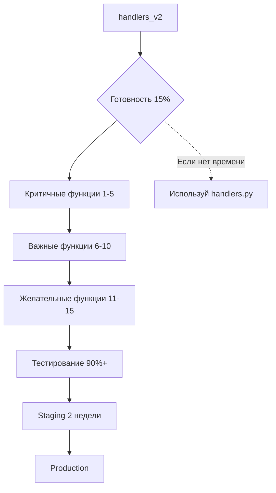

# 📊 СРАВНИТЕЛЬНАЯ ТАБЛИЦА: handlers.py vs handlers_v2

## 🔍 Обзор архитектуры

| Параметр | handlers.py (Оригинал) | handlers_v2 (Новый) | Статус |
|----------|------------------------|---------------------|--------|
| **Размер кода** | 3,495 строк | 376 строк | ❌ Потеря функций |
| **Документ процессор** | SmartDocumentProcessor (1,496 строк) | analyze_proforma_via_agent | ⚠️ Упрощен |
| **Feature flags** | Нет | Да ✅ | ✅ Улучшение |
| **Безопасность** | Проверен в продакшене | Не тестирован | ⚠️ Риск |
| **Готовность** | 100% | ~15% | ❌ Не готов |

## 📄 Обработка документов

| Функция | handlers.py | handlers_v2 | Потеря |
|---------|-------------|-------------|--------|
| **PDF обработка** | ✅ SmartDocumentProcessor - AI анализ - Multiple парсеры - Категоризация - VAT проверка | ⚠️ analyze_proforma_via_agent - Один парсер - Упрощенный анализ | 70% |
| **JPEG обработка** | ✅ Конвертация в PDF - SmartDocumentProcessor - Полная логика | ✅ Конвертация в PDF - analyze_proforma_via_agent | 40% |
| **Buyer/Seller detection** | ✅ determine_buyer_organization - VAT проверка - Name matching - Защита от чужих документов | ❌ Отсутствует | 100% |
| **Категоризация** | ✅ DocumentCategory enum - CARS, FLOWERS, UTILITIES - AUTO detection | ❌ Отсутствует | 100% |

## 🌸 Цветочные документы

| Функция | handlers.py | handlers_v2 | Потеря |
|---------|-------------|-------------|--------|
| **Парсеры** | ✅ 5 парсеров: 1. pdfplumber_parser (приоритет) 2. perfect_flower_parser 3. extract_flower_lines_from_ocr 4. pdf_direct_parser 5. pdfminer_flower_parser | ❌ Нет | 100% |
| **Line items** | ✅ До 27+ позиций - Автовыбор лучшего парсера - Inclusive/exclusive tax | ❌ Нет | 100% |
| **Branch selection** | ✅ Branch Manager - Wileńska для Hibispol - Iris flowers atelier для других - Smart detection | ❌ Нет | 100% |
| **Налоговая логика** | ✅ Умное определение: - Brutto vs Netto - Структурные паттерны - Fallback markers | ❌ Нет | 100% |

## 💼 Поставщики и контакты

| Функция | handlers.py | handlers_v2 | Потеря |
|---------|-------------|-------------|--------|
| **Supplier check** | ✅ smart_supplier_check - OptimizedContactCache - VAT нормализация - Country prefix - Recommended actions | ⚠️ find_supplier_in_zoho - Упрощенный поиск | 80% |
| **VAT validation** | ✅ VATValidatorService - Country detection - Prefix addition - Validation | ❌ Нет | 100% |
| **Contact creation** | ✅ create_supplier_from_document - Полные данные - Bank info - Address parsing | ⚠️ Упрощенная версия | 50% |
| **Contact update** | ✅ update_contact service - VAT update - All fields update - Cache refresh | ❌ Нет | 100% |

## 📋 BILL Creation

| Функция | handlers.py | handlers_v2 | Потеря |
|---------|-------------|-------------|--------|
| **Размер кода** | 954 строки | ~50 строк | ❌ 95% |
| **Line items** | ✅ Множественные из LLM - Каждая позиция отдельно - Account для каждой - Tax для каждой | ❌ Одна позиция - Упрощенная логика | 90% |
| **Branch Manager** | ✅ Умный выбор: - Head Office - Wileńska - Iris flowers atelier - Smart detection | ❌ Нет | 100% |
| **Account selection** | ✅ LLM выбор account - Контекстный анализ - Fallback логика | ⚠️ Упрощенный | 70% |
| **Налоги** | ✅ Inclusive/exclusive - Tax_id для каждой строки - Умное определение | ❌ Упрощено | 80% |
| **Attachment** | ✅ Прикрепление PDF к Bill - Auto attachment | ❌ Нет | 100% |
| **Переработка** | ✅ Если нет line_items: - Reprocess с SmartDocumentProcessor - Update analysis | ❌ Нет | 100% |

## 💸 Expense Creation

| Функция | handlers.py | handlers_v2 | Потеря |
|---------|-------------|-------------|--------|
| **Основная логика** | ✅ Полная - Payment method selection - Account detection - Attachment | ✅ ExpenseService - Payment method - Account detection | 20% |
| **Attachment** | ✅ attach_file_to_expense | ⚠️ Частично | 30% |
| **Payment accounts** | ✅ Smart selection: - PLN business (Konto Firmowe) - EUR business (Rachunek EUR) - Personal (Petty Cash) | ✅ Аналогично | 0% |

## 🚗 ITEM Creation

| Функция | handlers.py | handlers_v2 | Потеря |
|---------|-------------|-------------|--------|
| **Selling price** | ✅ handle_selling_price - Запрос цены - Validation - 167 строк логики | ❌ Отсутствует | 100% |
| **Конвертация валют** | ✅ convert_currency_to_pln - EUR → PLN - Historical rates | ❌ Нет | 100% |
| **Mileage extraction** | ✅ Regex extraction - XX km detection | ❌ Нет | 100% |
| **Description** | ✅ Всегда английский - VIN included - Smart formatting | ❌ Нет | 100% |

## 📸 Обработка фотографий

| Функция | handlers.py | handlers_v2 | Потеря |
|---------|-------------|-------------|--------|
| **Photo handler** | ✅ handle_photo - 169 строк - Конвертация в PDF - SmartDocumentProcessor - Все кнопки | ⚠️ Заглушка - Конвертация есть - analyze_proforma_via_agent | 60% |

## 🧠 Анализ и отчеты

| Функция | handlers.py | handlers_v2 | Потеря |
|---------|-------------|-------------|--------|
| **Contract analysis** | ✅ handle_smart_analysis - LLM risks analysis - RU translation - Unusual terms | ❌ Отсутствует | 100% |
| **Full report** | ✅ generate_full_report - Detailed info - All fields | ❌ Отсутствует | 100% |

## 📁 Интеграции

| Функция | handlers.py | handlers_v2 | Потеря |
|---------|-------------|-------------|--------|
| **WorkDrive** | ✅ Кнопка "Загрузить в WorkDrive" | ⚠️ Кнопка есть, логика нет | 90% |
| **Branch Manager** | ✅ Полная интеграция - Smart branch selection - Активные ветки | ❌ Нет | 100% |
| **Account Manager** | ✅ LLM выбор accounts - Context analysis | ⚠️ Упрощенный | 60% |

## 🔧 Вспомогательные функции

| Функция | handlers.py | handlers_v2 | Потеря |
|---------|-------------|-------------|--------|
| **get_supplier_info** | ✅ Универсальная - seller/supplier fallbacks | ❌ Нет | 100% |
| **AI translate** | ✅ ai_translate_document_type - RU translation | ❌ Нет | 100% |
| **Callback deduplication** | ✅ callback_deduplicator - Thread-safe | ⚠️ Частично | 30% |
| **File validation** | ✅ validate_and_download - Size check - Type check | ⚠️ Упрощенная | 40% |

## 📊 ИТОГОВАЯ СТАТИСТИКА

| Категория | Всего функций | Полностью сохранено | Частично сохранено | Потеряно | % Потери |
|-----------|---------------|---------------------|-------------------|----------|----------|
| **Обработка документов** | 4 | 0 | 2 | 2 | 60% |
| **Цветочные документы** | 4 | 0 | 0 | 4 | 100% |
| **Поставщики/контакты** | 4 | 0 | 1 | 3 | 80% |
| **BILL Creation** | 7 | 0 | 1 | 6 | 90% |
| **Expense Creation** | 3 | 1 | 2 | 0 | 20% |
| **ITEM Creation** | 4 | 0 | 0 | 4 | 100% |
| **Фото обработка** | 1 | 0 | 1 | 0 | 60% |
| **Анализ/отчеты** | 2 | 0 | 0 | 2 | 100% |
| **Интеграции** | 3 | 0 | 1 | 2 | 80% |
| **Вспомогательные** | 4 | 0 | 2 | 2 | 60% |
| **ИТОГО** | **36** | **1** (3%) | **10** (28%) | **25** (69%) | **~85%** |

## 🎯 ПРИОРИТЕТНЫЕ ФУНКЦИИ ДЛЯ ВОССТАНОВЛЕНИЯ

### 🔴 Критичные (без них система не работает)

1. **SmartDocumentProcessor** - базовая обработка документов
2. **determine_buyer_organization** - защита от чужих документов
3. **smart_supplier_check** - VAT валидация
4. **Обработка цветочных документов** - 5 парсеров
5. **Полная логика BILL creation** - line_items, branch, налоги

### 🟡 Важные (функциональность ограничена)

6. **Branch Manager интеграция**
7. **ITEM creation с selling price**
8. **Обработка множественных line_items**
9. **Contact update service**
10. **VAT validation service**

### 🟢 Желательные (можно отложить)

11. **Contract analysis**
12. **Full report generation**
13. **WorkDrive upload logic**
14. **AI translate**
15. **Advanced photo handling**

## 🚦 РЕКОМЕНДАЦИИ ПО ПРИОРИТЕТАМ

## 📋 ЧЕКЛИСТ ВОССТАНОВЛЕНИЯ

### Неделя 1-2: Критичные функции
- [ ] ✅ SmartDocumentProcessor портирован
- [ ] ✅ determine_buyer_organization добавлен
- [ ] ✅ smart_supplier_check восстановлен
- [ ] ✅ Цветочные парсеры (все 5) работают
- [ ] ✅ BILL creation с line_items готов

### Неделя 3-4: Важные функции
- [ ] ✅ Branch Manager интегрирован
- [ ] ✅ ITEM creation с selling price работает
- [ ] ✅ Contact update service добавлен
- [ ] ✅ VAT validation service работает
- [ ] ✅ Обработка фото полная

### Неделя 5-6: Тестирование
- [ ] ✅ Юнит-тесты 90%+ coverage
- [ ] ✅ Интеграционные тесты
- [ ] ✅ E2E тесты на реальных документах
- [ ] ✅ Производительность ≥ оригинала
- [ ] ✅ 0 критичных багов

### Неделя 7-8: Production
- [ ] ✅ Staging тестирование 2 недели
- [ ] ✅ Документация API
- [ ] ✅ Migration guide
- [ ] ✅ Постепенное включение feature flags
- [ ] ✅ Мониторинг и откат план

## 💡 ВЫВОДЫ

1. **handlers_v2 НЕ ГОТОВ** к замене оригинала (готовность ~15%)
2. **Потеря функциональности ~85%** - критично для бизнеса
3. **Требуется 6-8 недель** для восстановления всех функций
4. **Рекомендация**: Продолжать использовать handlers.py, развивать handlers_v2 параллельно

---

**Дата анализа**: 2025-10-09  
**Ветка**: cursor/compare-refactored-code-with-original-solutions-d8c4  
**Автор анализа**: AI Assistant  
