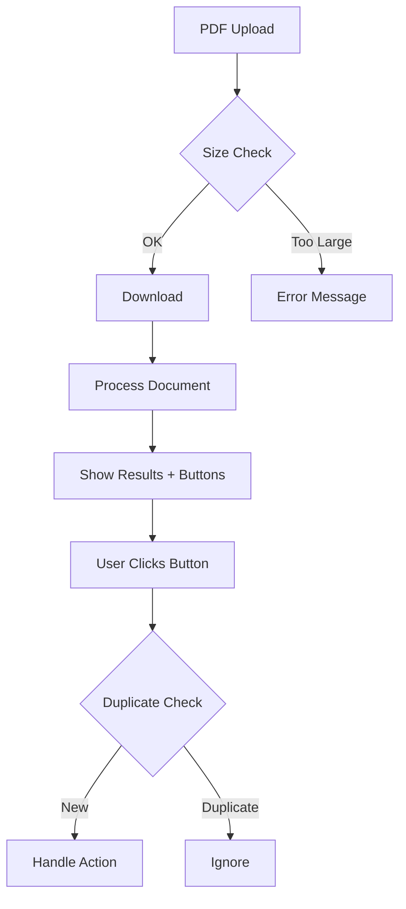

# Стратегия исправления багов и рефакторинга

## 🚨 Фаза 0: Критические исправления (1 день)

### 1. Race condition fix (30 минут)
```python
# telegram_bot/utils/callback_deduplicator.py
import asyncio
from typing import Set
from datetime import datetime, timedelta

class CallbackDeduplicator:
    def __init__(self):
        self._processing: Set[str] = set()
        self._lock = asyncio.Lock()
    
    async def is_duplicate(self, callback_id: str) -> bool:
        async with self._lock:
            key = f"{callback_id}:{datetime.now().timestamp()}"
            if callback_id in self._processing:
                return True
            self._processing.add(callback_id)
            
            # Очистка старых записей
            asyncio.create_task(self._cleanup_after(callback_id, 5))
            return False
    
    async def _cleanup_after(self, callback_id: str, seconds: int):
        await asyncio.sleep(seconds)
        async with self._lock:
            self._processing.discard(callback_id)

# В handlers.py - быстрый патч
from telegram_bot.utils.callback_deduplicator import CallbackDeduplicator
deduplicator = CallbackDeduplicator()

async def handle_callback(update: Update, context: ContextTypes.DEFAULT_TYPE) -> None:
    query = update.callback_query
    
    # Новая проверка
    if await deduplicator.is_duplicate(query.id):
        await query.answer("⏳ Обрабатывается...")
        return
    
    # Остальной код...
```

### 2. File size limit (15 минут)
```python
# telegram_bot/utils/file_validator.py
MAX_FILE_SIZE = 50 * 1024 * 1024  # 50MB

async def validate_and_download(file, context) -> str:
    """Безопасная загрузка с проверкой размера"""
    
    # Проверка размера
    if hasattr(file, 'file_size') and file.file_size > MAX_FILE_SIZE:
        raise ValueError(
            f"Файл слишком большой: {file.file_size / 1024 / 1024:.1f}MB. "
            f"Максимум: {MAX_FILE_SIZE / 1024 / 1024}MB"
        )
    
    # Безопасная загрузка
    with tempfile.NamedTemporaryFile(suffix='.pdf', delete=False) as temp_file:
        await file.download_to_drive(temp_file.name)
        return temp_file.name

# В handlers.py - быстрый патч
async def handle_pdf(update: Update, context: ContextTypes.DEFAULT_TYPE) -> None:
    try:
        # Заменить старый код на:
        temp_path = await validate_and_download(file, context)
    except ValueError as e:
        await update.message.reply_text(f"❌ {str(e)}")
        return
```

### 3. Убрать опасный global (10 минут)
```python
# Удалить:
# global last_document_analysis
# last_document_analysis = result.document_analysis

# Заменить на сохранение в контексте с уникальным ключом:
context.user_data[f'analysis_{update.effective_user.id}'] = result.document_analysis
```

## 📋 Фаза 1: Подготовка к рефакторингу (2 дня)

### 1. Создать тесты для критических путей
```python
# tests/test_critical_flows.py
import pytest
from unittest.mock import AsyncMock, MagicMock

class TestDocumentFlow:
    async def test_pdf_processing_success(self):
        """Тест успешной обработки PDF"""
        # Фиксируем текущее поведение
        pass
    
    async def test_duplicate_callback_prevention(self):
        """Тест предотвращения дублей"""
        pass
    
    async def test_large_file_rejection(self):
        """Тест отклонения больших файлов"""
        pass
```

### 2. Документировать текущие flow


## 📦 Фаза 2: Постепенный рефакторинг (1-2 недели)

### Шаг 1: Создать новую структуру (не трогая старый код)
```bash
# Создаем параллельную структуру
mkdir -p telegram_bot/handlers_v2/{commands,documents,contacts,bills,items}
mkdir -p telegram_bot/services_v2
mkdir -p telegram_bot/utils_v2
```

### Шаг 2: Feature flags для постепенной миграции
```python
# config/features.py
FEATURES = {
    'use_new_document_handler': False,  # Начнем с false
    'use_new_contact_handler': False,
    'use_new_bill_handler': False,
}

# В bot_main.py
if FEATURES['use_new_document_handler']:
    from telegram_bot.handlers_v2.documents import DocumentHandler
    handler = DocumentHandler()
else:
    from telegram_bot.handlers import handle_pdf as handler
```

### Шаг 3: Мигрировать по одному handler'у
```python
# handlers_v2/documents.py - новая чистая версия
from telegram_bot.services_v2.document_service import DocumentService
from telegram_bot.utils_v2.decorators import with_error_handling, with_size_limit

class DocumentHandler:
    def __init__(self):
        self.doc_service = DocumentService()
    
    @with_error_handling
    @with_size_limit(50 * 1024 * 1024)
    async def handle_pdf(self, update: Update, context: Context):
        """Чистая версия без легаси кода"""
        # 1. Загрузка
        file_path = await self._download_file(update.message.document)
        
        # 2. Обработка (вся логика в сервисе)
        result = await self.doc_service.process(file_path)
        
        # 3. UI (только отображение)
        await self._send_response(update, result)
```

## 🎯 Почему именно такой подход?

### ✅ Преимущества:
1. **Безопасность**: Критические баги исправлены сразу
2. **Непрерывность**: Система работает во время рефакторинга
3. **Откат**: Можно вернуться на старый код в любой момент
4. **Тестирование**: A/B тестирование старого и нового кода

### ❌ Риски полного рефакторинга сразу:
1. Можем сломать работающую систему
2. Сложно откатиться
3. Долго без результатов
4. Баги могут "переехать" в новый код

## 📊 Метрики для отслеживания

```python
# Добавить метрики в оба варианта кода
from prometheus_client import Counter, Histogram

handler_errors = Counter('handler_errors_total', 'Handler errors', ['handler', 'error_type'])
handler_duration = Histogram('handler_duration_seconds', 'Handler duration', ['handler'])

# Сравнение старого и нового кода
@handler_duration.labels(handler='old_pdf').time()
async def old_handle_pdf(...):
    pass

@handler_duration.labels(handler='new_pdf').time()  
async def new_handle_pdf(...):
    pass
```

## ⏱️ Timeline

- **День 1**: Критические баги ✅
- **День 2-3**: Тесты и документация
- **Неделя 1**: Первый handler (documents)
- **Неделя 2**: Остальные handlers
- **Неделя 3**: Удаление старого кода

## 🎯 Критерии перехода на новый код

1. Новый handler обработал 1000+ документов без ошибок
2. Метрики показывают улучшение (или не хуже)
3. Все тесты проходят
4. Команда обучена


